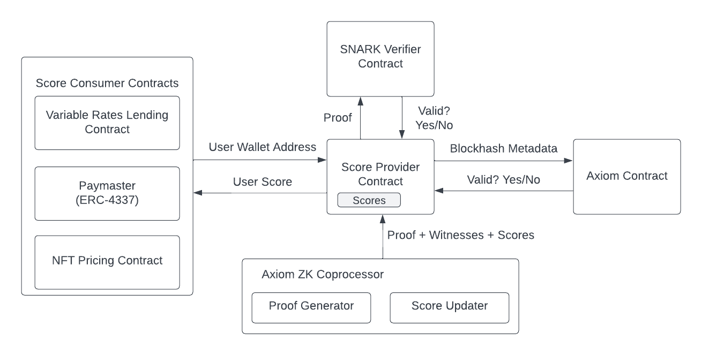

# Tanuki

## 🏆 Main Prize Winner ETHGlobal Tokyo

ETHGlobal Tokyo Demo: https://ethglobal.com/showcase/tanuki-s8ew9

## Overview

Tanuki is a trustless wallet scoring protocol. It uses ZKP’s to trustlessly read historical on-chain activity to calculate wallet scores. Wallet scores are modular, enabling use cases like paymasters with loyalty-based subsidies and lending protocols with variable rates.

## Architecture

## Use Cases

1. Reputation scores, e.g. [on-chain PageRank](https://twitter.com/brian_armstrong/status/1696923807855042601)
2. Credit score protocols which offer different terms to users based on their scores
3. NFT pricing models that consider the wallets' past interactions with the NFT to accurately estimate price.
4. Paymasters that determine the amount of gas fee reimbursement for each user. Currently, these methods are performed off-chain, resulting in centralized, less transparent, and trust-dependent systems.
5. Spam prevention on Lens: create a social credit score for accounts, only allow posting / interaction based on certain minimum score

### Deployments

#### Polygon Mumbai
[Twitter Link](https://twitter.com/0xminmi/status/1647453283936780289)

[GovernanceToken](https://mumbai.polygonscan.com/address/0x64845507e9304ea3427440837d5a000D9Aa08fc0)

[SimpleScoreProvider](https://mumbai.polygonscan.com/address/0x3baEf58f49e836d5127a161Ce827ecBa3577B73d)

#### Scroll Alpha

[GovernanceToken](https://blockscout.scroll.io/address/0x17C9378f864f04B6FaFB4783755d14e15c61a3b2)

[SimpleScoreProvider](https://blockscout.scroll.io/address/0xa23cD8e97730C4B099576a24816e6f9BCa2A395a)G

#### Taiko Hackathon Network

[GovernanceToken](https://l2explorer.hackathon.taiko.xyz/address/0xa23cD8e97730C4B099576a24816e6f9BCa2A395a)

[SimpleScoreProvider](https://l2explorer.hackathon.taiko.xyz/address/0xb3fdBFf207be9d12006C7eaE6635226280DE8556)

#### Mantle Test Net deployments

[GovernanceToken](https://explorer.testnet.mantle.xyz/address/0x64845507e9304ea3427440837d5a000D9Aa08fc0)

[SimpleScoreProvider](hhttps://explorer.testnet.mantle.xyz/address/0x3baEf58f49e836d5127a161Ce827ecBa3577B73d)

[SimpleScoreProvider](hhttps://explorer.testnet.mantle.xyz/address/0xd5bBa668908C2AB9c9926A505A24C368e401181a)
